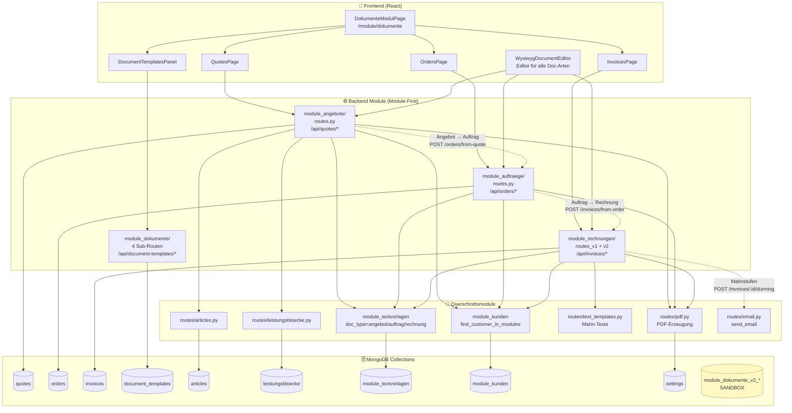

# Dokumente — Modul-Abhängigkeitsgraph

> Begleit-Diagramm zu `DOKUMENTE_ARCHITEKTUR.md`. Bild liegt parallel als
> `DOKUMENTE_MODULE_GRAPH.svg` im selben Ordner.

## Lese-Hilfe

| Symbol | Bedeutung |
|---|---|
| Pfeil **durchgezogen** | Direkter API-Aufruf oder Datenbank-Schreibzugriff |
| Pfeil **gestrichelt** | Workflow-Kette (ein Dokument erzeugt das nächste) |
| Pfeil **gepunktet** | Hilfsbeziehung (Validierung, Lookup) |
| Gelb gestrichelt | Sandbox / nicht produktiv |

## Was sagt mir das Bild?

1. **Eine Seite, vier Backends** — der Tab-Wrapper `DokumenteModulPage` schickt
   jeden Tab in genau ein Modul. Das ist kein Spaghetti-Code, sondern saubere
   Trennung pro Datenobjekt.

2. **Drei produktive Workflow-Ketten** sind klar erkennbar:
   - Angebot → Auftrag (Status-Übergang per Button)
   - Auftrag → Rechnung
   - Rechnung → Mahnung (3 Stufen, Mail-Versand integriert)

3. **`module_textvorlagen` ist das Rückgrat** — alle Auswahllisten
   (Betreff-Vorschläge, Status-Werte, Mahn-Stufen-Texte) hängen daran.
   Ändert man dort etwas, ändert sich das Verhalten in **allen** drei Modulen
   gleichzeitig — ohne Code-Änderung.

4. **Sandbox `module_dokumente_v2_*`** ist von keinem produktiven Modul
   verbunden. Dort ist Daten zu verlieren risikofrei, aber dort etwas zu
   bauen wird auch keinem Endkunden helfen, bis eine Migration gebaut wird.

## Wenn etwas „leer" wirkt

| Symptom | Wahrscheinliche Ursache |
|---|---|
| Dropdown bei „Betreff" leer | `module_textvorlagen` hat nichts mit `doc_type=angebot` |
| Artikel-Vorschläge fehlen | `articles`-Collection leer |
| Positions-Bündel fehlen | `leistungsbloecke`-Collection leer |
| Briefkopf falsch im PDF | `settings`-Collection nicht gepflegt |
| Mahn-Mail kommt nicht | SMTP-Config in `.env` oder Mahn-Vorlage in `text_templates` fehlt |
