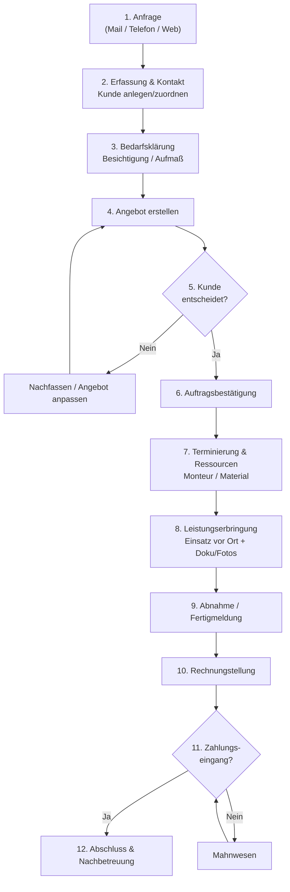
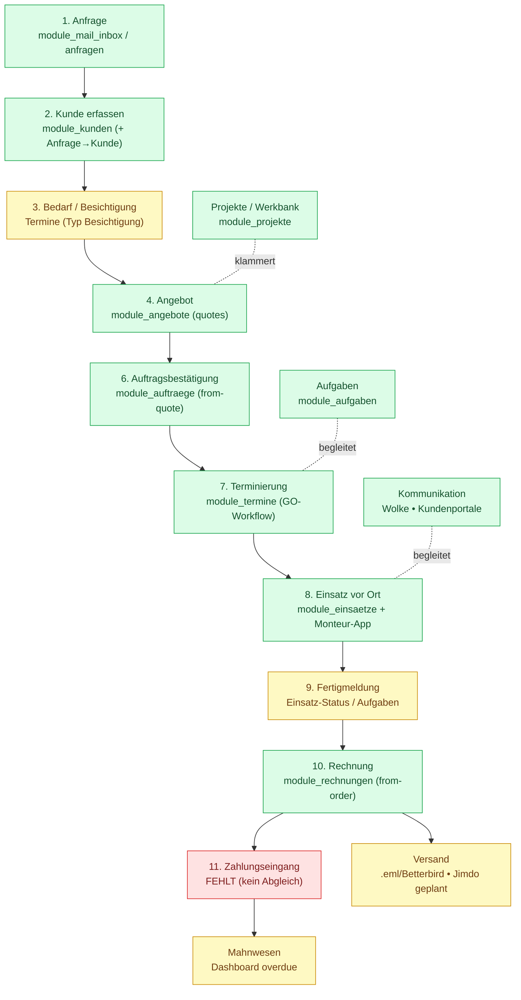

# Arbeitsablauf-Vergleich: Idealer Dienstleistungsprozess ↔ Graupner Suite
**Stand: 17.06.2026 (Hamburger Zeit) — read-only, kein Code geändert**

> Hinweis: Die Diagramme sind in **Mermaid** geschrieben. Sie werden in GitHub, VS Code (mit Mermaid-Plugin) und vielen Markdown-Viewern **bildlich** als Flussdiagramm angezeigt.

---

## 1) Idealer Arbeitsablauf eines Dienstleistungsunternehmens (Anfrage → Rechnung)

---

## 2) Graupner Suite — Ist-Zustand (mit zugeordneten Modulen)

*Legende:* 🟩 vorhanden · 🟨 teilweise/manuell · 🟥 fehlt

---

## 3) Vergleichstabelle Schritt für Schritt

| # | Idealer Schritt | Graupner-Modul | Status | Lücke / Anmerkung |
|---|-----------------|----------------|:------:|-------------------|
| 1 | Anfrage | `mail_inbox`, `anfragen` | 🟨 | Mail landet **nicht automatisch** in der Suite (Ingest fehlt) |
| 2 | Kunde erfassen | `kunden` (+ Anfrage→Kunde) | 🟩 | Umwandlung vorhanden (`dashboard.py`) |
| 3 | Bedarf/Besichtigung | `termine` (Typ Besichtigung) | 🟨 | Kein strukturierter „Aufmaß/Bedarf"-Schritt |
| 4 | Angebot | `angebote` (quotes) | 🟩 | Gültigkeit jetzt aus Einstellungen (heute gefixt) |
| 5 | Entscheidung/Nachfassen | Status `Versendet`/`Beauftragt` | 🟨 | Kein aktives Nachfass-/Erinnerungs-System |
| 6 | Auftragsbestätigung | `auftraege` (from-quote) | 🟩 | Angebot→Auftrag setzt Status „Beauftragt" |
| 7 | Terminierung/Ressourcen | `termine` (GO), `aufgaben` | 🟩 | GO-Workflow vorhanden |
| 8 | Leistung vor Ort | `einsaetze`, Monteur-App | 🟩 | Doku/Fotos/Reparaturauftrag |
| 9 | Abnahme/Fertigmeldung | Einsatz-Status / Aufgaben | 🟨 | Kein klarer „Abnahme"-Schritt mit Kundenunterschrift |
| 10 | Rechnung | `rechnungen` (from-order) | 🟩 | Auftrag→Rechnung setzt „Abgerechnet"; **2 Systeme** (v1/v2) |
| 11 | Zahlungseingang | — | 🟥 | **Kein Zahlungsabgleich/-Tracking** |
| 12 | Mahnwesen/Abschluss | Dashboard overdue | 🟨 | Mahnungen nur Anzeige, kein Mahnlauf-Workflow |
| – | Versand | `.eml`/Betterbird, `eml_export` | 🟨 | Profi-HTML heute ergänzt; direkter Jimdo-SMTP-Versand vorbereitet (Option B) |
| – | Kommunikation | `wolke`, `kundenportal` | 🟩 | Nachrichten + Portale |

---

## 4) Lücken & Sackgassen (Zusammenfassung)
**🟥 Echte Lücken (fehlt):**
1. **Automatischer Mail-Eingang** in die Suite (Ingest).
2. **Mail → Projekt/Angebot**: 100 % Handarbeit.
3. **Zahlungseingang-Tracking** (Soll/Ist, offene Posten).
4. **KI-Angebots-Assistent** (Anfrage → Angebotsentwurf).
5. **Kalender-Sync**: nur `kalender_export` (iCal-Export) vorhanden, **kein** Live-Sync (z. B. Google).

**🟨 Schwachstellen/Doppelungen (Aufräum-Kandidaten — separater Audit):**
- `module_rechnungen/routes_v1.py` **und** `routes_v2.py` parallel.
- `module_kundenportal` **+** `module_portal_v2_backup`.
- `_archiv`-Ordner (frontend 28 Dateien + backend).
- 117 `TODO/FIXME/deprecated`-Marker im aktiven Code.

---

## 5) Empfehlung (Reihenfolge)
1. **Aktuelle Fehler** abschließen (laufend).
2. **Dashboard** als „Cockpit" über diesen Ablauf neu aufbauen (vorgemerkt, Aufgabe `95b4b4e8…`).
3. **Option B – direkter Mailversand (Jimdo-SMTP)** → schließt Schritt „Versand/Kommunikation".
4. **Zahlungseingang-Tracking** (Schritt 11) – größte echte Lücke fürs Rechnungswesen.
5. **Architektur-Audit `ARCHITEKTUR_AUDIT.md`** → Doppelsysteme/Leichen sauber abbauen (nur mit Einzel-Freigabe + DB-Snapshot, Regel 5).

> **Wichtig (Regel 5/12):** Dies ist reine **Bestandsaufnahme**. Es wurde **nichts geändert/gelöscht**. Aufräumen erst nach deiner ausdrücklichen Einzel-Freigabe + Snapshot.
